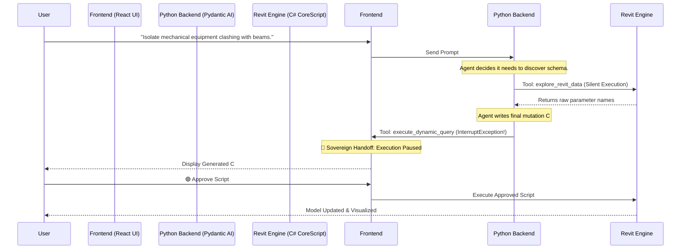
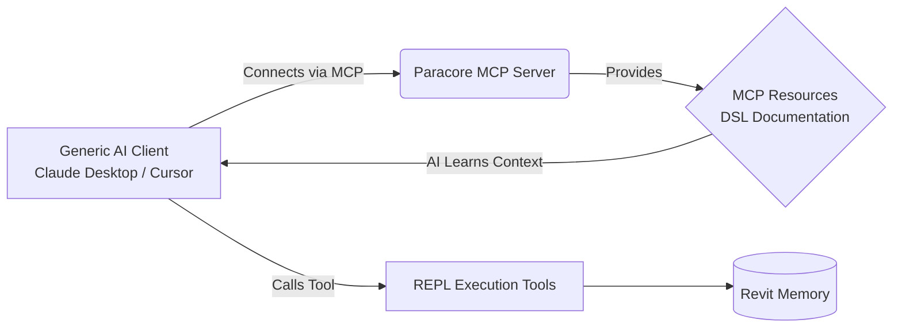

# Paracore Agent Architecture: Redefining BIM Automation
> **An architectural review of Paracore’s REPL-based agent vs. standard market solutions and the Model Context Protocol (MCP).**

---

## 1. The Core Problem: The "1,000 Tool" Limitation in BIM

The vast majority of current AI orchestration frameworks (LangChain, CrewAI) and early market BIM AI assistants are built on a **Deterministic Tool-Based Paradigm**. 

In this paradigm, an agent relies on hardcoded functions (e.g., `get_walls()`, `check_intersection()`, `set_parameter_value()`). While this works for simple office automation (email scanning, simple SQL), it fundamentally collapses in Building Information Modeling:

*   **Massive Scale:** The Autodesk Revit API contains over 30,000 unique classes, methods, and properties.
*   **High Dimensionality:** Real-world queries are rarely simple. (*e.g., "Find all mechanical equipment on Level 2 intersecting structural framing with a null 'Fire Rating', and color them red."*)
*   **High Contextuality:** Parameter structures change drastically per model, per family, and per firm.

Building a preconfigured tool for every possible BIM action is impossible. The agent becomes bottlenecked by the API coverage of its developers.

---

## 2. The Paracore Solution: Sovereign Code Generation

Instead of equipping the agent with 1,000 rigid tools, Paracore equips the agent with **one tool with infinite capability: a C# Compiler.**

Paracore utilizes a **REPL (Read-Eval-Print Loop) Generation Architecture**, powered by `Pydantic AI` and the highly optimized `CoreScript.Engine`.

### Tool Simplification
The agent operates with only two carefully scoped tools:

| Tool | Execution | Purpose | Token Strategy |
| :--- | :--- | :--- | :--- |
| `explore_revit_data` | **Silent (Background)** | Schema discovery. Allows the agent to "peek" at parameter names or class structures before writing a final script. | Truncated at 8,000 chars to prevent context flooding. |
| `execute_dynamic_query` | **Sovereign Handoff** | The final action. Generates the exact C# code needed to solve the user's multi-step request. | Triggers a UI pause for human approval. |

### The "Sovereign Handoff" (Human-In-The-Loop)
To eliminate the massive risk of autonomous AI mutating live production BIM data unpredictably, Paracore employs a Sovereign Handoff pattern.

By delegating the execution logic to the fluent `CoreScript.Engine` Domain Specific Language (DSL) (e.g., `element.GetStr()`, `.WhereParam()`), the AI is writing Turing-complete code capable of handling transactions, unit conversions, and complex LINQ filtering in a single bound.

---

## 3. Market Comparison & The 2027 Era (MCP)

How does Paracore stack up against the broader market and the incoming standard for the "2027 Agent"?

### Current BIM Agents (2024-2025)
Most commercial BIM AI tools today map natural language to specific hardcoded macros. They are highly constrained, rigid, and fail on novel requests. Many attempt to export the entire Revit model to a graph database (which is painfully slow) instead of interacting with the in-memory API natively.

### The Model Context Protocol (MCP)
Anthropic's **Model Context Protocol (MCP)** is the emerging standard for connecting AI clients (Claude Desktop, Cursor) to local data sources. A standard MCP server exposes rigid tools to the client.

**Paracore's Advanced MCP Implementation (`mcp_server.py`)** solves the MCP "tool limitation" natively:
1.  **Exposing the Compiler:** Paracore exposes the REPL Engine itself over MCP via `explore_revit_data` and `execute_dynamic_query`.
2.  **Exposing the Context:** Paracore exposes its custom C# DSL documentation (`paracore://system-prompt`, `paracore://repl-guide`, `paracore://extension-methods`) as **MCP Resources**.

### Conclusion
By turning the compiler into the tool, wrapping it in a secure Sovereign Handoff pipeline, and exposing the resulting ecosystem via FastMCP, Paracore is fundamentally a generation ahead of standard tool-routing agents in the AEC industry.

---

## 4. Agent Enhancements Roadmap

To move from a developer-focused assistant to a fully autonomous enterprise agent, the following architectural enhancements are planned:

### A. Self-Correction / Iterative Debugging (Auto-Healing)
* **Goal:** Capture C# compiler and runtime errors and pass them back to the agent in a loop (up to 3 retries) so it can auto-correct its generated C# REPL scripts before presenting them to the user.

### B. Multi-Step Orchestration and Planning (Sequential Actions)
* **Goal:** Enable the agent to break down a complex natural language goal into a sequence of multiple steps. The UI should display the plan step-by-step, allowing the user to click, inspect, and approve parameters or code for each step before execution.

### C. Local Schema Caching (Schema RAG)
* **Goal:** Cache Revit model elements, parameters, categories, and families into a local SQLite database at startup. This allows the agent to search for schema names locally and quickly instead of running live, slow `explore_revit_data` queries in Revit.

### D. Decoupled Execution Summaries
* **Goal:** Move execution summary parsing entirely to `rap-server`. The C# backend should only return raw execution results/data, while `rap-server` computes clean summaries (e.g. "Processed 120 walls, updated 30 parameters") to avoid bloat in the agent's context window.

